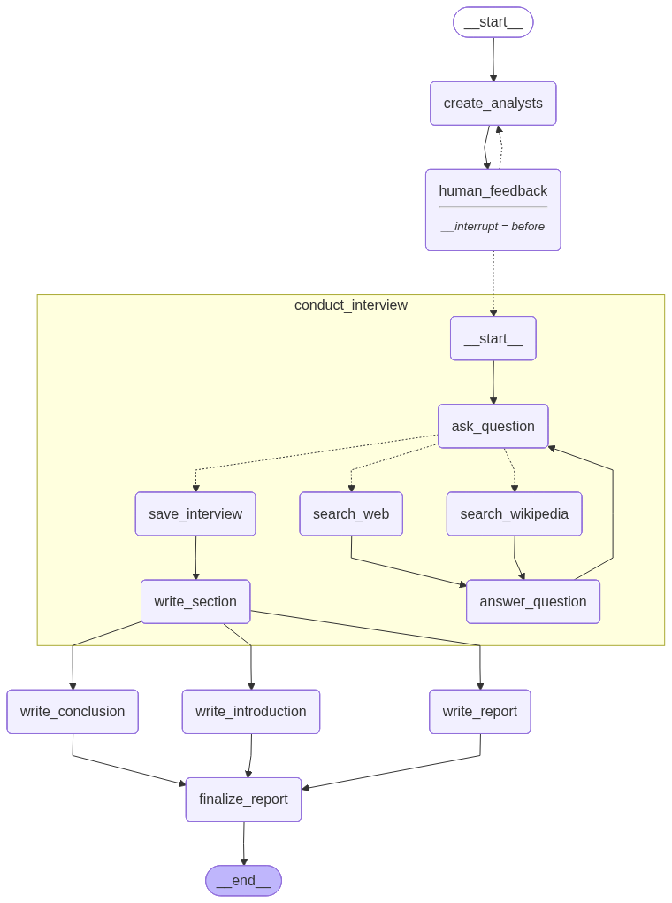
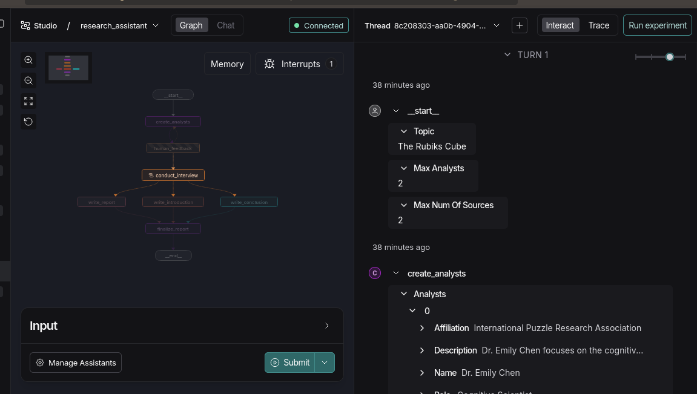

# Research Assistant
- Research assistant using LangGraph, and Tavily. 
- Modification of the [LangChain Foundations Course Research Assistant](academy.langchain.com/courses/take/intro-to-langgraph/lessons/58239974-lesson-4-research-assistant)
- Clone, add `.env` file with API keys(check `.env.example`), and install dependencies from `requirements.txt`.
- Run `code.ipynb` for step by step implementation.
- Navigate to `studio`, and run `langgraph dev` for studio implementation, or `python main.py` for terminal version.

